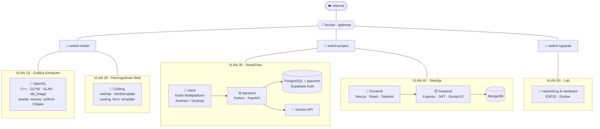
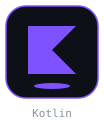
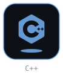
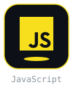
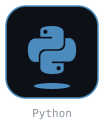

<p align="center">
  
</p>

<p align="center">
  
  
  
  
</p>

<br/>

## 🖥️ `$ neofetch`

```text
        .--.           achmad@fauzan
       |o_o |          ─────────────────────────────────────
       |:_/ |          OS        Mahasiswa · Universitas Negeri Semarang
      //   \ \         Host      Jawa Tengah, Indonesia
     (|     | )        Kernel    networking + hardware
    /'\_   _/`\        Shell     data processing & software
    \___)=(___/        Uptime    on GitHub since Aug 2024
                       Packages  Go · Kotlin · C++ · JavaScript · Python
                       Motto     pelan-pelan asal konsisten
```

> **TL;DR** — hati di hardware, tangan di software. I like knowing how things connect, dari kabel sampai kode.

<br/>

## 🧬 `$ cat about.go`

```go
package main

func main() {
    me := Developer{
        Name:      "Achmad Fauzan",
        Campus:    "Universitas Negeri Semarang",
        Interests: []string{"networking", "hardware", "mikrokontroler"},
        DailyWork: []string{"data processing", "software development"},
        Learning:  []string{"Golang", "Kotlin", "OpenGL"},
        OpenTo:    []string{"kolaborasi", "diskusi", "project iseng yang serius"},
    }

    for me.IsCurious() {
        me.Learn()
        me.Build()
        me.Ngeteh() // wajib, bukan opsional
    }
}
```

<br/>

## 🗺️ `$ nmap --topology fauzan`

Kalau yang saya kerjakan digambar sebagai jaringan, kira-kira begini. Satu gateway, tiga switch, tiap project punya VLAN sendiri:



<br/>

## ⚙️ `$ top`

```text
PID   TASK                              STATE      NOTE
001   belajar Golang web service        running    semester ini
002   ngulik networking & hardware      running    hobi yang nggak pernah selesai
003   tugas kuliah                      running    priority: realtime
004   tidur cukup                       sleeping   segmentation fault
```

<br/>

## 🧰 `$ ls ~/toolbox`

<p align="center">
  
  
  
  
  
</p>

<table>
  <tr>
    <td width="170"><b>Web</b></td>
    <td>
      
      
      
      
      
    </td>
  </tr>
  <tr>
    <td><b>Data</b></td>
    <td>
      
      
      
    </td>
  </tr>
  <tr>
    <td><b>Hardware & Grafis</b></td>
    <td>
      
      
    </td>
  </tr>
  <tr>
    <td><b>Tools</b></td>
    <td>
      
      
      
      
      
    </td>
  </tr>
</table>

<br/>

## 📂 `$ ls -l ~/projects`

<table>
  <tr>
    <td width="50%" valign="top">
      <h3>📚 <a href="https://github.com/AchmadFauzan1156/StudyFlow">StudyFlow</a></h3>
      <p>Aplikasi Android untuk bantu ngatur alur belajar, biar deadline nggak datang tiba-tiba.</p>
      
      
      
    </td>
    <td width="50%" valign="top">
      <h3>🎨 <a href="https://github.com/AchmadFauzan1156/OpenGL">OpenGL</a></h3>
      <p>Catatan dan eksperimen computer graphics — from a single triangle to something that moves.</p>
      
      
      
    </td>
  </tr>
  <tr>
    <td width="50%" valign="top">
      <h3>📦 <a href="https://github.com/AchmadFauzan1156/stokaja-backend">StokAja · Backend</a></h3>
      <p>API di balik sistem manajemen stok StokAja.</p>
      
      
      
    </td>
    <td width="50%" valign="top">
      <h3>🛒 <a href="https://github.com/AchmadFauzan1156/stokaja-frontend">StokAja · Frontend</a></h3>
      <p>Sisi pengguna dan dashboard admin StokAja, dua-duanya sudah live.</p>
      <a href="https://stokaja-frontend.vercel.app"></a>
      <a href="https://stokaja-admin-frontend.vercel.app"></a>
      <a href="https://github.com/AchmadFauzan1156/stokaja-admin-frontend"></a>
    </td>
  </tr>
</table>

<br/>

## 📈 `$ uptime --stats`

<p align="center">
  
  
</p>

<details>
  <summary><b>📊 Grafik kontribusi (klik untuk buka)</b></summary>
  <br/>
  
</details>

<br/>

## 📡 `$ ping fauzan`

```text
PING fauzan (github.com/AchmadFauzan1156): 56 data bytes
64 bytes: ada ide project?        → buka issue, ayo dibahas
64 bytes: nemu bug?               → kabari, nanti saya benerin
64 bytes: mau ngobrol jaringan?   → gas, kapan aja

--- fauzan ping statistics ---
3 packets transmitted, 3 received, 0% packet loss
```

<p align="center">
  <a href="https://github.com/AchmadFauzan1156"></a>
</p>


